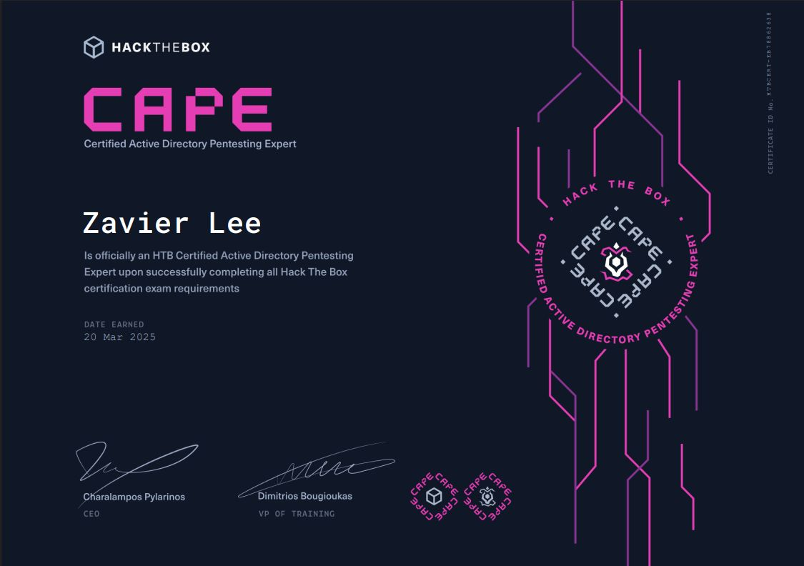
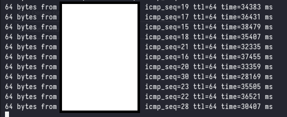

Earlier this month, I took the [Certified Active Directory Pentesting Expert (CAPE)](https://academy.hackthebox.com/preview/certifications/htb-certified-active-directory-pentesting-expert) certification exam and passed with 10/10 flags after 2.5 days of mind-numbing AD attacks. This post is a review of the course and exam, and my experience with it.

## Overview

> As I was making this post, another CAPE holder made a [review](https://medium.com/@filip.bartosz.wozniak/hackthebox-cape-certification-700737050cd6) of the certification, which I would highly recommend reading.

The [Certified Active Directory Pentesting Expert (CAPE)](https://academy.hackthebox.com/preview/certifications/htb-certified-active-directory-pentesting-expert) certification is a gruelling 10-day long exam that tests the candidate's ability to exploit Active Directory environments, this includes an industry-standard report that is expected to be delivered by the end of the 10 days. This course is meant to be a sequel to the [Certified Penetration Testing Specialist (CPTS)](https://academy.hackthebox.com/preview/certifications/htb-certified-penetration-testing-specialist), and candidates are expected to have the knowledge and skills covered in the CPTS course.

All in all, it took me around 2 months to complete the course content while balancing full-time work. The exam itself took about 2.5 days, followed by another 2 days to write the report, which ended up being roughly 130 pages - about 30 pages shorter than my CPTS report. The grading of my report took (surprisingly) **one** working day!

### The Good

The course and exam are, without a doubt, the best training I’ve encountered for Active Directory exploitation. The attack explanations are exceptional, the content is well-organized, and I frequently find myself revisiting the material as a reference. The [NTLM Relay Attacks](https://academy.hackthebox.com/module/details/232), [ADCS Attacks](https://academy.hackthebox.com/module/details/236), [Active Directory Trust Attacks](https://academy.hackthebox.com/module/details/253) and [MSSQL, Exchange, and SCCM Attacks](https://academy.hackthebox.com/module/details/267) modules offer some of the clearest and most effective explanations I’ve come across for such (relatively) complex topics.

The exam is (imo) by far the most difficult AD exam on the market, and it achieves this without relying on unrealistic vectors or overly complex attacks. The exam is well designed, and the attacks are fully in-scope of the course material - with the bulk of the difficulty coming from enumerating, and chaining together the various attacks.

Unfortunately, I find it difficult to draw any meaningful comparison between the CAPE and other AD certifications, as the difficulty far surpasses that of any other certification I have taken. However, I would say that it is somewhere between the [Cybernetics](https://app.hackthebox.com/prolabs/overview/cybernetics) and [APTLabs](https://app.hackthebox.com/prolabs/overview/aptlabs) prolabs in terms of **AD Exploitation** difficulty (specifically the AD exploitation sections of the labs).

### The Bad

> The following is based on my own experience with the course and exam, and may not be representative of the experience of others.

Some modules - such as the [Active Directory BloodHound](https://academy.hackthebox.com/module/details/69) module, felt completely unnecessary to make an entire module out of. The same can be said for modules that teach a specific tool such as the [Using CrackMapExec](https://academy.hackthebox.com/module/details/84) module, I do not believe that a module should be dedicated to teaching a specific tool, especially when the content of the module seems to be a copy-paste of the tool's documentation.

During the exam, I found that the exam environment was very unstable, with exploit chains frequently requiring multiple resets to work. Additionally, at some points the latency was so bad that it was impossible to work effectively and I had no choice but to restart the lab.

However, the other CAPE holders that I spoke to did not experience the same issues, so it is possible that this was an isolated incident. Furthermore, HTB does not currently have any servers outside of EU/US, so the latency issues are not unexpected as I am in Singapore (APAC/Asia).

### How do I prepare?

Before beginning the CAPE course, I would recommend that you either have completed and passed the CPTS exam and/or have an extremely sound understanding of Active Directory. This course is **not** for beginners.

Ensure that you have fully understood the course material (very important), and are able to complete most/all of the skill assessments without any external help. The exam is pretty brutal in terms of understanding the underlying concepts, and you will need to know why you are doing what you are doing and why your attacks work when they do.

That being said, everything in the exam is in-scope of the course material, however it may require some intuition and creative thinking to chain together the various attacks.

I would set aside at least 2 months to comfortably complete the course content, and to redo the modules that you found difficult. The time investment for the CAPE is significant if you are not already familiar with Active Directory exploitation.

### Tips & Tricks

* For those living in APAC/Asia/anywhere outside of EU/US, prepare for an insane amount of latency. I was able to stabilize my latency at ~210ms by using a VPN to connect to a VPS in Germany, followed by using the `EU` VPN server in the HTB VPN. 
    * Alternatively, prepare to use the provisioned PwnBox, which is located in the same datacenter as the exam servers - I opted not to use the PwnBox as I didn't want to deal with the latency of the PwnBox itself and to copy in all of my tools (including a licensed copy of Cobalt Strike).
* Remember to take frequent breaks, the exam is absolutely a marathon and not a sprint. 10 days is a lot of time to work with, and you needn't rush to pass on the first attempt as you will be given a second attempt if you fail the first but have submitted a report.
* For those coming from CPTS, I personally felt that each flag of CAPE was **minimally** as "difficult" as CPTS' 9th flag with the CAPE exam having multiple flags that were significantly more difficult - which is expected as CAPE is a sequel to CPTS.
* Having a solid methodology and well-organized notes is **extremely important**. It's just as important to recognize when to abandon a path, dig yourself out of a rabbit hole, and take a moment to mentally reset.
* Understand the limitations of the tools you are using, and assumptions that you are making. For example, if you are using BloodHound, actively think about what the tool _can_ and _cannot_ see.

### FAQ

* Should I do CAPE before CPTS?
    * No, CAPE is a sequel to CPTS and builds upon the knowledge and skills covered in CPTS. You should complete CPTS before attempting CAPE.

* CAPE or `<insert cert here>` Certification?
    * Instead of listing out a comparison chart, I will instead say that CAPE focuses purely on internal assessments - specifically in Active Directory environments. If you are looking for a certification that focuses on specifically AD exploitation, then CAPE is the certification for you. Additionally, it is also important to note that although CAPE is an extremely technically challenging certification, you will **not** currently receive the same HR recognition as you would with something like OSEP.