I did 6 certifications in 9 months, so that you don't have to!

## Introduction

In 2024, I decided to spend the year collecting as much knowledge in the form of certifications as physically possible in order to fully utilize the [Industry Preparation for Pre-graduate (iPREP) Programme](https://www.imda.gov.sg/-/media/imda/files/about/media-releases/2017/annex-a---factsheet-of-the-iprep-programme.pdf) offered by [The InfoComm Media Development Authority (IMDA)](https://www.imda.gov.sg/).

The `iPREP` Programme is a scheme that greatly subsidizes (up to SGD$500.00) the cost of selected certifications for students currently enrolled in a local institute of higher education. Unfortunately, a quick google search of the programme does not yield many results - but the [National University of Singapore (NUS)](https://nus.edu.sg/cfg/home/24) and the [Singapore Management University (SMU)](https://computing.smu.edu.sg/undergraduate/beyond/iprep) have pages dedicated to the programme, although the latter seems to be locked behind a login wall.

Thankfully for me, [Singapore Polytechnic (SP)](https://www.sp.edu.sg/) is also a participating institution and I was able to take advantage of the scheme.

I managed to complete the following certifications during my full-time study at SP (in no particular order):
* [OffSec Certified Professional (OSCP+)](https://www.credential.net/6bf1e148-b2ea-490b-83dd-d4b33203720c) ❌
* [Certified Penetration Testing Specialist (CPTS)](https://www.credly.com/badges/994bae50-fd4d-4cb2-9e49-fa1dd46844ee/) ❌
* [Certified Red Team Lead (CRTL)](https://eu.badgr.com/public/assertions/qSieUe-JSvK3Q3r3oGYjQA) ❌
* [Certified Red Team Operator (CRTO)](https://eu.badgr.com/public/assertions/B15X3Nb5TgaphN0epdKnbg) ✅ - SGD$500
* [Certified Red Team Expert (CRTE)](https://www.credential.net/648733ee-30f4-461d-ab3e-347e75870609) ❌
* [Certified Red Team Professional (CRTP)](https://www.credential.net/c43291df-a1c5-47d3-84cf-30702829adb7)  ❌
* [Certified Azure Red Team Professional (CARTP)](https://www.credential.net/a41e5fc9-46dc-4a6b-84f7-a0f5ca45c21f#gs.7d8lp5) ❌
* [eLearnSecurity Junior Penetration Tester (eJPTv2)](https://certs.ine.com/fa4d8f27-743b-4475-b676-a2f9fbe203be#gs.67vdcs) ✅ - Full Reimbursement

I have not been reimbursed for **all** of the above certifications, and cannot attest to whether or not the above certifications are still eligible for the `iPREP` Programme at this point in time. This post will be edited to reflect the current state of the reimbursement, as the reimbursement process can take a couple of months.

## Certification Dilemma

A fair warning that the remainder of this post may have controversial opinions, please don't continue reading if you are easily offended.

Many people have asked me about the value of certifications and whether they are worth the time and effort - especially those in a similar situation to mine, currently enrolled in a local institute of higher education.

### Will I be good after getting the certifications?

No, certifications are simply a means to an end - and are not a replacement for experience and should **not** be viewed as such. I believe that it is the practical experience that you gain from the certifications that are the most valuable, and not the certification itself.

The objective of certifications is to give you the relevant fundamental knowledge to do your own research, and to provide you with a structured learning path that you can follow. Simply copying and pasting commands from course materials won’t make you a professional, nor will relying solely on the knowledge provided in those materials.

If you don't have any relevant industry experience - you can express your competence by doing independent research, doing some box writeups, working on projects, or really anything that shows that you have a genuine interest in the field.

### Is it worth the time?

I will be addressing the question of whether or not certifications are worth the time in the **context of a full-time student in high school, or university**.

I firmly believe that pursuing certifications doesn’t require dedicating a significant amount of time. In fact, a large portion of the time I spent on certifications was during lectures and tutorials, where my lecturer was quite literally reading directly from the slides.

Generally, the only times I dedicated time outside of my daily "working" hours to certifications was when I was doing the examination for the course - a couple hours on the weekend or holidays were dedicated to this.

If you're able to multitask relatively well, and relate to the above situations, then I would say that grinding out certifications is definitely worth the time - and probably more useful than listening to your lecturer drone on about the same topic for the 5th time.

### Is it worth the effort?

Contrary to what I just said, I believe that _some_ certifications are absolutely worth grinding out - even if it means sacrificing a couple of hours after school, or on the weekends.

If you intend to pursue a career in offensive security in Singapore, [you will minially require the OffSec Certified Professional (OSCP) certification or the CREST Registered Tester (CRT) certification.](https://docs.developer.tech.gov.sg/docs/security-testing-guidelines/penetration-test)

For Singaporean pre-enlistees, you will have plenty of time during your National Service (NS) to grind out the OSCP certification. For those who have completed their NS or are not required to serve (female, non-Singaporean, etc.), I would recommend grinding out the OSCP certification as soon as possible.

If the latter applies to you, and are currently enrolled in a Polytechnic - then it's great news because the work load in Polytechnic is significantly less than that of a University so you'll have plenty of time to grind it out. More importantly, the possibility of failure isn't as daunting, as you have plenty of time to retake the examination before entering the workforce.

If you intend to join the workforce directly after graduating from a Polytechnic, then you will absolutely require the OSCP (and more) to be even be considered for a junior role in most offensive security teams. (it's not up to them, OSCP/CRT is the industry requirement in order to remain compliant).

### Is it worth the money?

It depends™

Some certifications are absolutely worth it for the knowledge that they provide, such as the [Certified Penetration Testing Specialist (CPTS)](https://academy.hackthebox.com/preview/certifications/htb-certified-penetration-testing-specialist), [Certified Red Team Operator (CRTO)](https://training.zeropointsecurity.co.uk/courses/red-team-ops), and [Certified Red Team Expert (CRTE)](https://www.alteredsecurity.com/redteamlab) - but others can simply be another line on your resume.

Ultimately, it depends on your goals and aspirations. If you're looking to join a red team, then the CRTO may be worth it simply for the on-hands practice with [Cobalt Strike](https://www.cobaltstrike.com/) for an affordable price.

## Thoughts

Rather than writing a detailed review for every certification that I have completed (since so many others have already done so), I will just provide a general review of each certification that I have completed. Additionally, I will address the questions that people have asked me in private; and questions that I wish I had the answers to when I was starting out.

Some answers may have repeated information as I expect people to only read the sections that they are interested in.

### General Reviews

First and foremost, I must say that I finished some certifications at an unrealistic pace as I had some prior experience with the topics covered in the certifications. On the contrary, I was either studying full-time, or working full-time during the period(s) that I completed the certifications.

#### eJPTv2 (July 2023)

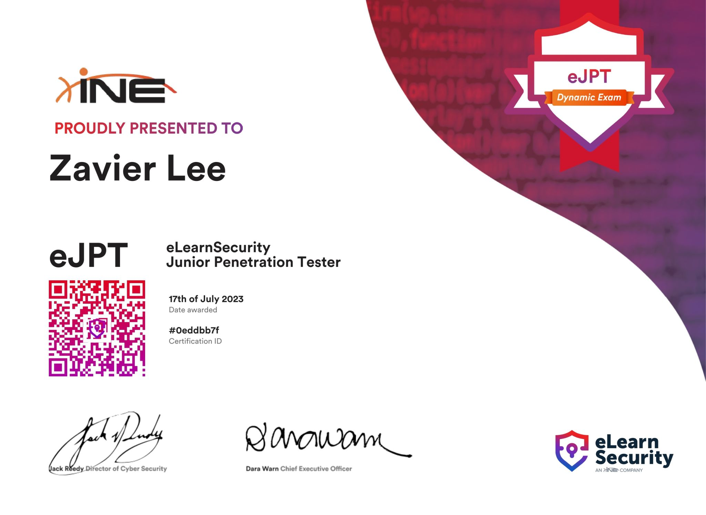

Prior to the eJPTv2, I had been doing primarily Easy/Medium boxes on Hack The Box for about 3-4 months. I started the eJPTv2 exam nearly right after buying the course with 0 lab completion, **the exam took me around 1 hour to complete**.

I wouldn't pay for the eJPTv2 certification out of pocket, but if you can get it reimbursed then it's a good way to show that you have some interest in security outside of your studies.

Would I do it again? ❌

#### CRTO (October 2023)

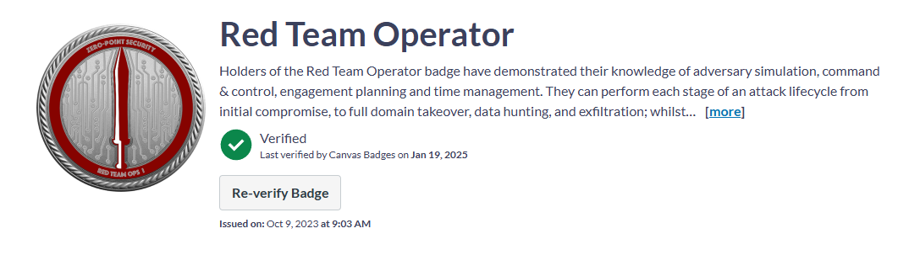

The labs took me about **20 hours to complete (over a 2 week period)**, additionally reading through the course materials took south of **2 weeks at about 2 hours of study per day**. This course was really good, I covered a little more about it here: [#crto-crtl](#crtl--crto)

The exam took me around **8 hours in total to complete**, including a 4-hour nap where I did not shut off the exam timer. 

Would I do it again? ✅ in a heartbeat

#### CARTP (April 2024)

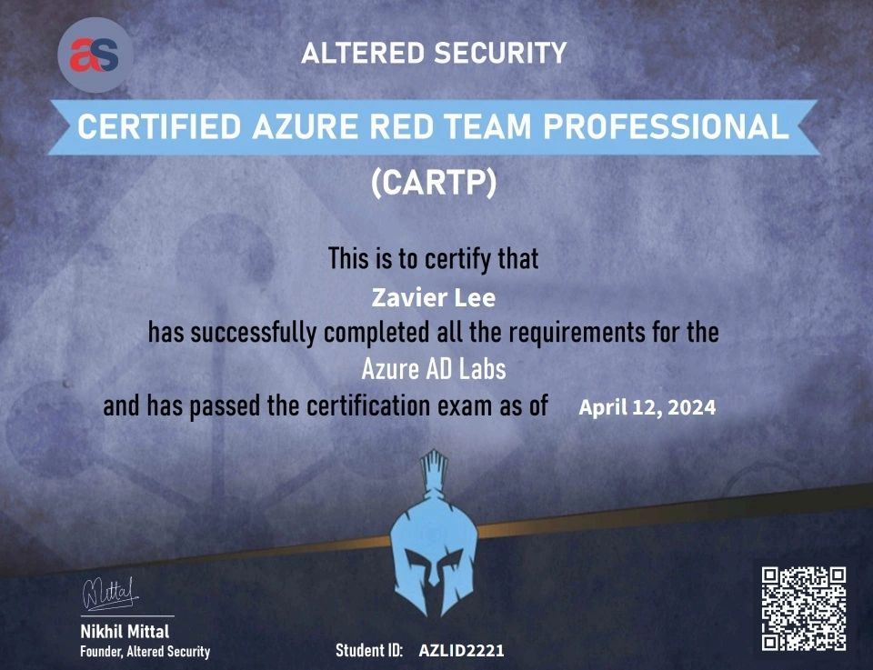

This venture was a little bit strange as I had no prior experience with Azure, but felt like learning some cloud one day. The labs took me about **5 days to complete (at 8 hours per day)**, and the exam took me around 4 hours to complete.

The course materials were actually pretty good at teaching the basics of Entra ID, my only complaint was that it felt like the labs kept going in circles and taking a weird detour midway through an exploitation chain.

Would I do it again? ❌ (only if it was reimbursed)

#### CRTP (July 2024)

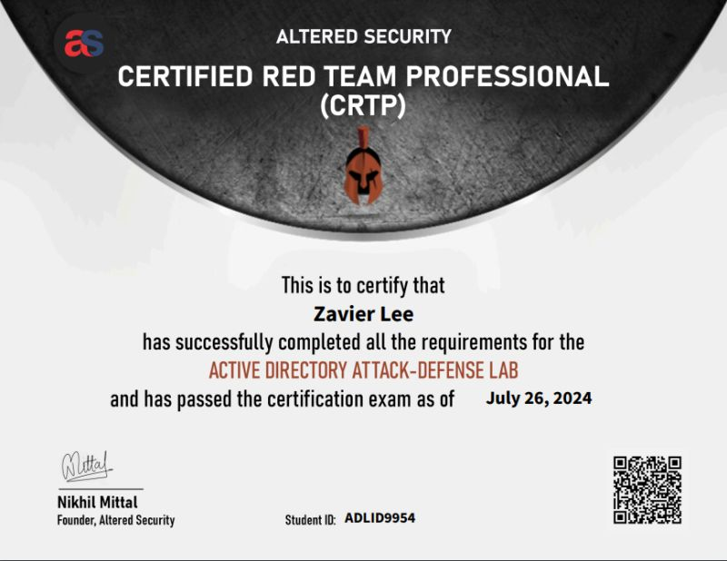

> For both the CRTP and CRTE, I _must_ add that I had extensive prior experience with Active Directory exploitation and largely did _not_ follow the content taught in the course and opted to use my own methodology and tooling instead.

Prior to attempting the CRTP, I had completed the CRTO, and the Dante, Rasta, Zephyr, Offshore and Cybernetics prolabs on Hack The Box. See: [here](https://gatari.dev/posts/economic-rt/).

The labs took me about **2 days to fully complete, at 14 hours a day**. The exam took me around **1 hour** to fully complete, excluding the reporting time which took an additional hour. The exam was extremely straightforward, and should be doable in a similar time frame for anyone who has completed the labs (without referring to the lab writeup).

I used [Sliver](https://github.com/BishopFox/sliver) for the lab & exam, and performed most attacks from Linux. I'd recommend checking out [Mythic](https://github.com/its-a-feature/Mythic) and [Havoc](https://github.com/HavocFramework/Havoc) too.

Would I do it again? ❌ (only if it was reimbursed)

#### CRTE (August 2024)

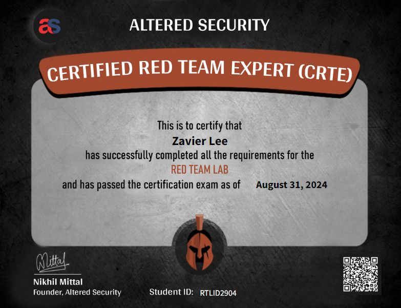

Prior to attempting the CRTP, I had completed the CRTO, CRTP, and the Dante, Rasta, Zephyr, Offshore and Cybernetics prolabs on Hack The Box. See: [here](https://gatari.dev/posts/economic-rt/).

I'd heavily recommend making full use of your lab time (especially so for CRTE) as the labs are incredibly valuable, I even used it for [this blog post](https://gatari.dev/posts/ad-linux/). I'd also recommend learning to use a C2 framework for this exam, although it's completely unnecessary; it can make your life a lot easier if used correctly. The above linked blog post may help get you started with [Sliver](https://github.com/BishopFox/sliver).

The labs took me about **4 days to fully complete, at 8 hours a day**. 

The exam took me around **3 hours** to fully complete. The exam was really fun, and although relatively straightforward, has some difficult quirks that may trip you up if you're not really familiar with your tools.

Similar to the CRTP, I used [Sliver](https://github.com/BishopFox/sliver) for the lab & exam.

Would I do it again? ✅

#### OSCP+ (November 2024)

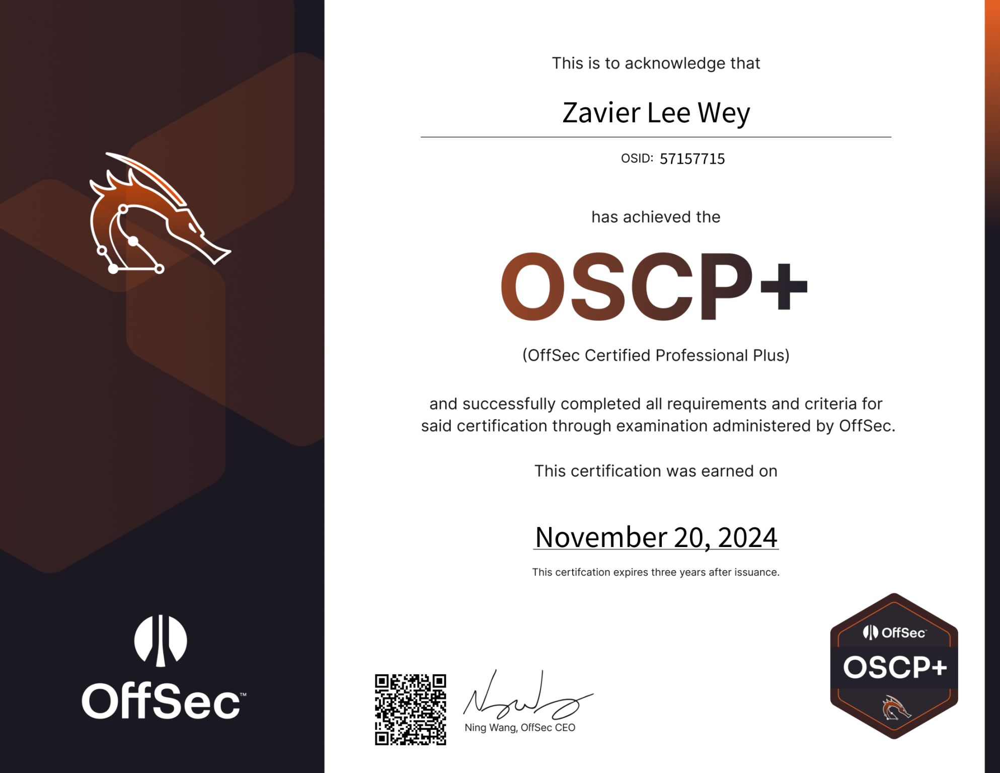

I'll go in greater detail about the OSCP+ exam in the [next section](#how-hard-is-the-new-oscp), but I'll provide a general review of my experience with the OSCP+ course. Over the course of about **2 months**, I fully completed [Lainkusanagi's OSCP-Like PG Practice Boxes](https://docs.google.com/spreadsheets/d/18weuz_Eeynr6sXFQ87Cd5F0slOj9Z6rt/edit?gid=487240997#gid=487240997), [Secura, Medtech, OSCP-A-B-C, Zeus and Poseidon Challenge Labs](https://portal.offsec.com/courses/pen-200-44065/labs).

I did not do any of the PEN-200 labs, or course material and fully relied on the above (and prior experience) to pass the OSCP+ exam. The exam took me **3 hours to achieve a passing score**, of which only 10/40 points were from the Active Directory set.

Would I do it again? ✅ (only if it was required by the industry)

#### CPTS (December 2024)

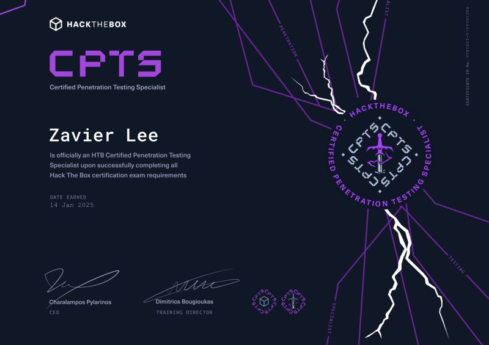

Although I only receieved the passing notification in January 2025, I completed the CPTS exam with 100/100 points and submitted my report in December 2024. 

The full **Penetration Tester path took me about 6 months** to complete, but I realistically only spent about **2 months** actively working on the modules. (~4 hours a day).

The exam took me around **3 days** to get 14/14 flags, and the report took an additional **2 days** to complete and totalled around 165 pages; which was also my first time writing a report.

I highly recommend the CPTS certification to anyone who is looking to get into offensive security, and I still frequently refer back to the course materials for reference when working on other labs.

Would I do it again? ✅ absolutely

#### CRTL (January 2025)

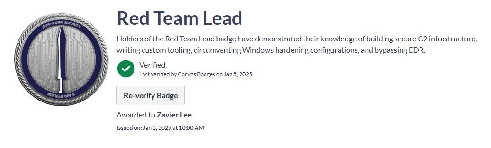

The CRTL course is probably one of the best purchases I have made in terms of certifications. The course provides an extremely gentle introduction to EDR evasion, and does **not** handhold you through the process of evading common rules. 

Instead, there's a larger focus on teaching the methodology and thought process behind evading EDRs. This method of teaching is a complete 180 from the prequel (CRTO) which is quite handholdy in comparison.

I couldn't recommend this course enough to anyone who is looking to get into red teaming, [@RastaMouse](https://x.com/_RastaMouse) did an incredible job designing this course.

The exam took me around **4 hours** to get a passing score, and I did not buy the labs - however I had a [local lab running Elastic 12.2 with Ludus](https://docs.ludus.cloud/docs/environment-guides/elastic), ignoring the [8.8+ kernel call stack detections](https://www.elastic.co/security-labs/upping-the-ante-detecting-in-memory-threats-with-kernel-call-stacks) as the course was designed with 8.5 in mind. 

For those who have your own [Cobalt Strike license](https://www.cobaltstrike.com/), and a home-lab running Elastic - [these are the rules](https://github.com/elastic/protections-artifacts/tree/7544cd7c2e7aa2b2a5552e45610e6837b3777d1a/behavior/rules) I used for my local practice. For the Elastic AV, just ensure that you can evade the latest version.

Would I do it again? ✅ in a heartbeat

### How hard is the new OSCP+?

> FWIW: There are a lot of other reviews that claim the opposite of what I'm about to claim.

I found my exam set to be significantly harder than the general consensus of the OSCP exam sets, although there seems to be a divide on this topic. I know several people who found the exam incredibly easy, and others who also found it incredibly difficult - it is ultimately up to which exam set you get.

Similar to [this post by Xre0us](https://xre0us.io/posts/cpts-oscp-and-you/#oscp-1), my exam set also had standalones that _required_ custom scripts to be written in order to exploit the box. The existing OSCP (PEN-200) materials _do not_ sufficiently prepare an individual to pass the OSCP+ exam currently, it almost feels as if Offsec **wants** you to fail the exam to milk you for an additional retake fee.

That being said, I passed the OSCP+ exam with 70/100 points (10 AD + 3x20 Standalone) in 3 hours and unfortunately could not guess hard enough to complete the remainder of my AD set - which I did not care to finish anyway.

I would love to see some statistics on the passing rate of the OSCP exam based on which set the individual received, sometimes I wonder if Offsec themselves review these statistics.

The post linked below has a more extensive discussion on the current state of OSCP:

* [https://www.linkedin.com/posts/robin-unglaub_tldr-kicking-off-the-year-with-the-oscp-activity-7284950654417063936-YI08/?utm_source=share&utm_medium=member_desktop](https://www.linkedin.com/posts/robin-unglaub_tldr-kicking-off-the-year-with-the-oscp-activity-7284950654417063936-YI08/?utm_source=share&utm_medium=member_desktop)

### CPTS or OSCP?

In light of the [recent updates](https://www.offsec.com/blog/everything-you-need-to-know-about-the-oscp-plus/) to the OSCP Certification, the [comical 10% flat price increase](https://www.reddit.com/r/oscp/comments/1hpm0ft/oscp_prices_are_increasing_from_jan_2025/) in January 2025, the exam sets being nothing short of a [rigged lottery](https://www.linkedin.com/posts/robin-unglaub_tldr-kicking-off-the-year-with-the-oscp-activity-7284950654417063936-YI08/?utm_source=share&utm_medium=member_desktop), and the fact that the CPTS is a fraction of the price - I find it increasingly difficult to recommend the OSCP to anyone.

Additionally, my exam set for OSCP felt more akin to the syllabus of [CRTP](https://www.alteredsecurity.com/adlab) which is definitely out of the official scope of the PEN-200 course (sometimes I wonder if Offsec does this on purpose). See: [here](#crte--crtp)

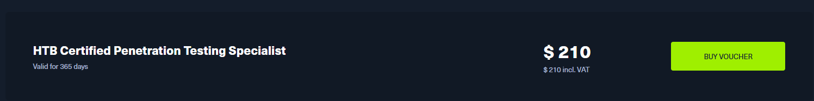

The CPTS covers everything that OSCP does, and more - and the exam was much harder, but did not feel nearly as frustrating as my OSCP exam did. Additionally, the reporting requirements for the CPTS are much more stringent than that of the OSCP, which is a good thing as it forces you to write a report that is more inline with what you would be expected to write in a professional setting. 

My CPTS report totaled around 165 pages, with a [proper executive summary, methodology, detailed findings, remediations and findings](https://docs.sysreptor.com/assets/reports/HTB-CPTS-Report.pdf), whereas my OSCP report was a measly 30 pages that was [essentially a walkthrough of the boxes](https://docs.sysreptor.com/assets/reports/OSCP-Exam-Report.pdf).

It is worth noting the sentiment that "passing CPTS guarantees that you will pass OSCP" does not hold as much truth in 2025, as the OSCP exam sets have become increasingly difficult (in terms of obscurity), and playing Roulette or Baccarat will probably prepare you better for some of the exam sets.

That being said, as mentioned earlier, the OSCP is still the industry requirement for most offensive security roles in Singapore (and most other countries) - so if you're looking to join an offensive security team, you will eventually have to bite the bullet and roll the dice on OSCP.

### CRTL, CRTO, CRTE or CRTP?

This was probably the most asked question that I received, and the answer is simple - you can't compare CRTL/CRTO with CRTE/CRTP as they are fundamentally different certifications that cater to different audiences.

#### CRTL / CRTO

[CRTL](https://training.zeropointsecurity.co.uk/courses/red-team-ops-ii) and [CRTO](https://training.zeropointsecurity.co.uk/courses/red-team-ops) are incredible courses by [Zero-Point Security](https://training.zeropointsecurity.co.uk/) that cover adversary simulation, with a focus on operational security (OPSEC) and covert operations. The course is incredibly hands-on, and you will be using [Cobalt Strike](https://www.cobaltstrike.com/) for the majority of the course.

Although _some_ attacks are taught, the focus is **not** on the attacks themselves but rather the OPSEC failures that may lead to detection - by it's nature, the course is catered to more experienced testers who are looking to improve their tradecraft, **not** complete beginners trying to learn Active Directory exploitation. 

Additionally, CRTL is a continuation of CRTO with Elastic 8.5 running on Prevent mode - which significantly adds to the difficulty of the course.

> That being said, the CRTO was my first certification, and I was able to complete it with no prior experience - but I would not recommend it to someone who is a complete beginner.

#### CRTE / CRTP

Now, if you are a complete beginner trying to learn Active Directory exploitation, then these 2 course are more suited for you. [CRTP](https://www.alteredsecurity.com/adlab) and [CRTE](https://www.alteredsecurity.com/redteamlab) are more focused on Active Directory exploitation, with the latter being the continuation of the former.

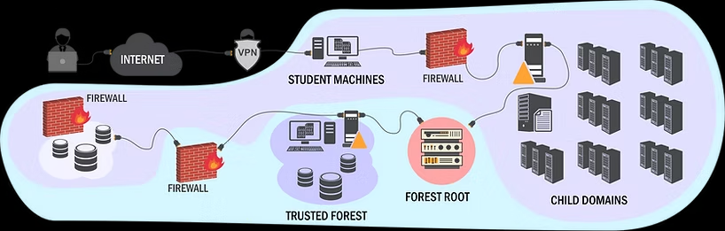

If you're fresh out of OSCP/CPTS, and looking for a course that will teach you how to exploit Active Directory, then you're probably looking for either of these certifications. Whichever one you choose is up to you, but I would recommend starting with the CRTP if you have never done Active Directory exploitation before.

Similarly, if you're short on time/money, skipping CRTP might be wise.

### I'm a student, how do I get started?

I strongly recommend starting with the CPTS certification, it'll give you the fundamentals to do pretty much any other certification that you want to do. Additionally, the CPTS is the cheapest certification on this list (if you are a student, see next paragraph), and is the most beginner friendly.

If you have an email that is associated with an educational instution, you can get a [USD$8.00/month subscription to Hack The Box Academy](https://help.hackthebox.com/en/articles/7973133-getting-the-student-subscription) - which unlocks all Tier II modules. These modules are enough to complete the full path for the CPTS, CBBH and CDSA certifications, although exam vouchers are sold separately.

I have personally fully completed the CPTS, CBBH, CWEE, and the new CAPE (ty CSA) paths on Hack The Box Academy, and can attest to the quality of the content. After completing the CPTS, you can look into OSCP/CRTP/CRTE in any order of your choice depending on your goals.

> CPTS, CBBH and CDSA are Tier II paths, CWEE and CAPE have Tier III modules that will not be covered by the student subscription.

### I'm considering a career change, how do I get started?

As mentioned [above](#is-it-worth-the-effort), in Singapore you will minimally require the OSCP or CRT certification to be considered for a role in an offensive security team. Unfortunately, you will need to grind out the OSCP certification as soon as possible, as the industry requirement is not up to the companies themselves.

Depending on how much time you have (or desperate you are), you can look into the CPTS certification to get a feel for the industry and see if it's something that you're interested in before biting the bullet on OSCP.

### What do I do after CPTS?

Congratulations on completing the CPTS certification, the exam and the whole path is pretty difficult and you should take a short break and celebrate your achievement. After that, you'll probably have to think about your goals.

Once again, unfortunately if you're in Singapore, OSCP is the next logical step if you're looking to join an offensive security team. If you're not in a rush to get into the industry, you should think about what specialization you're interested in.

If you're into AD, then CRTP/CRTE (you can skip CRTP) is what I'd recommend, see: [#CRTE](#crte-august-2024). If you're into red teaming, then CRTO is a great next step, see: [#CRTO](#crto-october-2023). I can't comment on other specializations.

### How about CAPE? (Hack The Box)

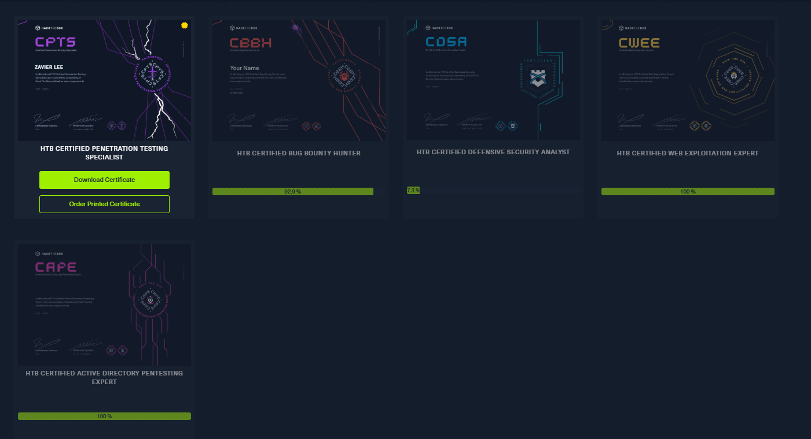

The [Certified Active Directory Penetration Testing Expert (CAPE)](https://academy.hackthebox.com/preview/certifications/htb-certified-active-directory-pentesting-expert) is Hack The Box's newest AD certification, and is supposed to be the successor to the CPTS. I have not done the exam so I cannot comment on the examination difficulty but I have completed the CAPE learning path.

The CAPE learning path is a lot more difficult than the CPTS learning path, and I would recommend having some prior experience with Active Directory exploitation before attempting the CAPE learning path - I'd recommend having at least completed the CPTS before starting on the CAPE learning path. (but it's optional of course)

The CAPE learning path is also [significantly more expensive than the CPTS learning path (~USD$1000)](https://www.reddit.com/r/hackthebox/comments/1hb53lp/comment/m1g4ewj/?utm_source=share&utm_medium=web3x&utm_name=web3xcss&utm_term=1&utm_content=share_button), and is not nearly as recognized as something like [OSEP](https://www.offsec.com/courses/pen-300/) (not that I would be happy to recommend that either).

The CAPE path took me about **2 months** to fully complete.

### eJPTv2 or OSCP?

Okay so, I've seen a lot of people asking this question and I think it's a little bit silly. The [eJPTv2](https://security.ine.com/certifications/ejpt-certification/), and the OSCP are not comparable in difficulty.

eJPTv2 doesn't really show any technical competency, although it can be useful in demonstrating that you have some interest in security outside of your studies; other than that. Additionally, eJPTv2 has an extremely large reliance on the [Metasploit Framework](https://www.metasploit.com/) which is only allowed one usage in OSCP (not that it helps anyway)

If you currently have the eJPTv2 and feel discouraged by what I just said, not to worry - it's still a good certification to have on your resume, and can be a good conversation starter in interviews. Although, I had a rude awakening when I realized that the eJPTv2 was not nearly as difficult as the OSCP.

### How about the web certifications?

I have not done any web certifications, and cannot comment on the difficulty or quality of the web certifications that are available. I have completed most of the [PortSwigger Academy Labs (BSCP)](https://portswigger.net/web-security), most of the [CBBH](https://academy.hackthebox.com/preview/certifications/htb-certified-bug-bounty-hunter) path and fully completed the [CWEE](https://academy.hackthebox.com/preview/certifications/htb-certified-web-exploitation-expert) path but never found the motivation to complete the exams.

### OSCE3 when?

When I have the time, and the money. please hire me: zavier@gatari.dev

### Should I follow your path?

I was fortunate enough to only have small battles with burnout throughout the year, and largely attribute my success against burnout with the fact that I only worked on certifications together with my full-time studies - and never outside of my daily "working" hours. My time outside of "school" was largely unaffected by the certifications, and I was able to maintain a healthy work-life balance.

However, I know many people that dedicated a significant amount of time to certifications which resulted in severe burnout, and ultimately a lack of interest in the industry or even losing interest in cyber entirely. I strongly encourage taking your time and avoiding comparisons with others, even though I understand how challenging that can be.

Ultimately, as mentioned earlier, certifications are merely a means to an end. Having certifications **does not** necessarily indicate that someone is skilled at what they do, just as not having certifications **does not** imply that someone lacks ability.

## Conclusion

Cybersecurity is **not** easy, and it is **not** something that you can learn in a couple of months. Please join a couple communities to help along the way, and don't be afraid to ask questions.

Feel free to join some communities, and/or reach out to me on [Discord](https://discord.com/users/192548255098208256) if you have any questions.

## Useful Links

* [Vulnlab Discord](https://discord.com/invite/vulnlab)
* [0xH3xSec Discord](https://discord.gg/AqnUssuf85)
* [Zero-Point Security Discord ](https://discord.gg/Whz3YtY4gG)
* [Hack The Box Discord](https://discord.gg/hackthebox)
* [OSCP+ Page](https://www.offsec.com/courses/pen-200/)
* [CPTS Page](https://academy.hackthebox.com/preview/certifications/htb-certified-penetration-testing-specialist)
* [CRTL Page](https://training.zeropointsecurity.co.uk/courses/red-team-ops-ii)
* [CRTO Page](https://training.zeropointsecurity.co.uk/courses/red-team-ops)
* [CRTP Page](https://www.alteredsecurity.com/adlab)
* [CRTE Page](https://www.alteredsecurity.com/redteamlab)
* [CARTP Page](https://academy.hackthebox.com/preview/certifications/htb-certified-azure-red-team-professional)
* [eJPT Page](https://security.ine.com/certifications/ejpt-certification/)